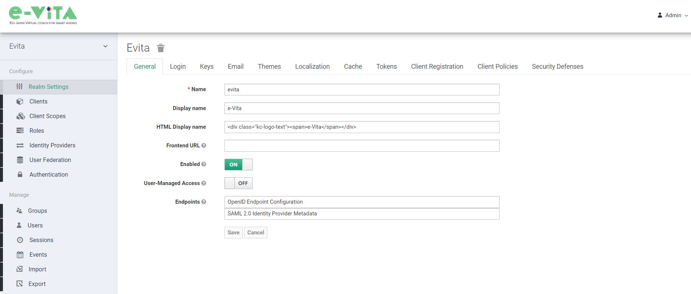
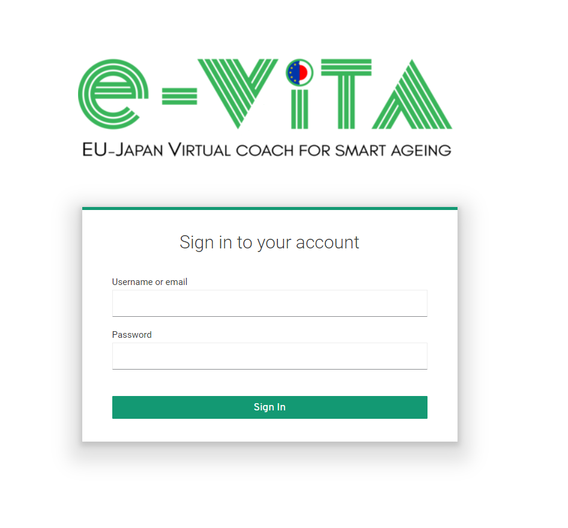
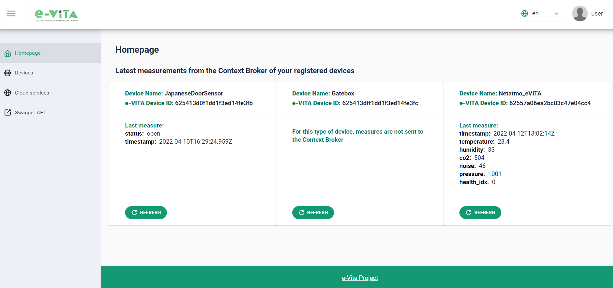
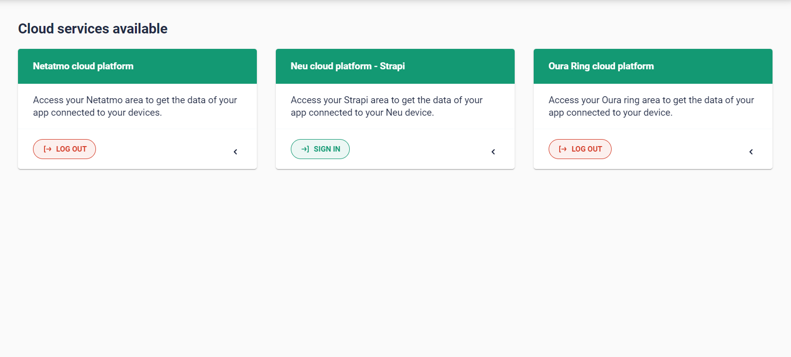

# **e-VITA Platform prototype – dashboard**

The following section describes the functionalities provided by the e-VITA platform that can be accessed through the e-VITA dashboard, mainly related to the registration and management of personal devices. The e-VITA platform dashboard has been implemented using _Ngx-admin_, one of the most popular and trusted front-end Angular open-source dashboard templates (NGX-ADMIN, 2022).

## Keycloak Identity manager – administration console

As previously mentioned in section 1.2.1, Keycloak is the tool used within e-VITA as a third-party authorization server to manage the authentication and authorization of the users.

The default theme proposed by the Keycloak server has been customized for the e-VITA application; in this way it was possible to have a specific look and feel for the end-user facing Keycloak administration console, login, welcome page, emails, and for the user&#39;s profile page.

Keycloak provides an administration console that is used to manage realms. Within each realm it is possible, for an administrator, to register users and client applications managing roles and their associations with the users.

## Keycloak Identity manager – user registration and login

In order to access e-VITA dashboard the user has to log in to the platform using the e-VITA Keycloak identity manager, using the login form shown in Figure 17. In order to access, however, the user must first register in Keycloak through the appropriate section shown in Figure 18, to generate personal Keycloak credentials (E-mail and Password).

After registering on the Keycloak platform and logging in, the user will be redirected directly to the Homepage of the e-VITA platform dashboard.

## User profile information

At the first access to the e-VITA platform, additional information will be requested to the user to complete the ones provided during the registration phase. This additional information will be used to provide personalised service to the e-VITA user. Currently the information to be provided are:

- User _Country:_ considering the context of use of the e-VITA platform within the project_,_ the countries that can selected are France, Italy, Germany and Japan.
- User _City:_ based on the previous selection, the user can choose one of the cities belonging to the selected Country.
- User _Language:_ considering the possible Countries that the user can select, the provided languages that can be chosen by the user will be Italian, English, French, German and Japanese.

Only once this information has been entered, it will be possible for the user to access the main dashboard.

## Homepage: general overview of the devices

The Homepage is the first page of the e-VITA dashboard where is presented an overview of the devices registered by the user. The page presents a _card_ graphic component for each device previously registered by the user; each of them provides the following device information:

- _Device Name:_ the name chosen by the user and associated with the device during device registration phase.
- _Device ID:_ an alphanumeric string associated with the device during device registration phase, generated and assigned internally by the e-VITA platform in order to uniquely identify the device.
- _Information about the last measurement provided by the device:_ this section of the card shows the last measurement sent by the device (or, in the case of a device associated with a Cloud Service, the last measurement of the device taken from the relative external cloud service), if present. This information is obtained through a request to the Orion Context Broker (more information about this component in 1.2.2 paragraph). The last measurement is collected and saved in the Orion Context Broker only for two categories of devices: smart home sensors and wearable devices (more information about the device categories in the 2.5.1 paragraph). The other device category, the Coaching Devices, on the other hand, do not provide measurements but exchange text messages with the e-VITA platform and them are, therefore, not stored within the Orion Context Broker.
- A _Refresh_ button: this button allows the user to visualize the last updated measurement of the device, if its value has changed.

## Device page: devices management

In the Devices page it is possible to view all the devices already registered by the user. The visualization of them on the page is organized through _cards_ graphic component_;_ in each of them the essential information and all the possible operations for the device are exposed. Figure 21 shows the e-VITA platform _Devices_ page.

The basic information of the device shown on each card are the following:

- _Device Name:_ The Name assigned by the user to the device during the registration phase.
- _Device Type:_ the specific type of the device (go to 2.5.1 paragraph for the classification of the device types supported by the platform).

The possible operations on the device are the following:

- _Delete:_ through this operation, the user will delete the specific device from the e-VITA platform and the related data in the Object Storage and the Orion Context Broker. More details on this operation in section 2.5.4.
- _Details:_ through this operation, the user will be able to view a specific page where are included detailed information of the selected device and instructions for sending and/or reading the measurements. More details on this operation in 2.5.2 paragraph.
- _Enable/disable:_ Through this operation, the user has the possibility to change the status of the device: by disabling it, the device information and previous collected data will remain saved in the e-VITA platform, but the device will be not able to send/receive data. More details on this operation in 2.5.3 paragraph.

### Device registration

In the Devices page of the e-VITA dashboard, the user has the possibility to register a new device. By clicking on the Add button, a dedicated page will be displayed for storing a new device in the user&#39;s account.

The Figure 22 shows the registration device page. In this phase, the e-VITA dashboard asks the user to enter the following fields:

- _Device Type_: the specific device type to be added, by selecting one of all the possible available values. More details about the possible device types are detailed in the second part of the current paragraph.
- _Source Device Id_: this value corresponds to the original identification code of the device (if present). This identifier is entered by the user during this phase or, in if the e-VITA platform can obtain it automatically, it is pre-filled.
- _Measures Frequency_ (optional parameter that is present only for specific device types): it is a field that allows the user to configure a time parameter. More details on this field are present in the second part of the current paragraph.

The Table 1 shows the classification of the possible devices currently supported by the e-VITA platform. It should be noticed that, in e-VITA platform, the devices are managed as logical entities related to the different typologies of measure that the device provides, therefore for some real devices there can be more logical devices. For instance, in the system, there are three different logical Oura Ring devices (OURARING\_ACTIVITY, OURARING\_READINESS, OURARING\_SLEEP) even there is only one real device that provides all these measurement

The table includes the following attributes:

- _Device Type:_ the specific device type supported within the e-VITA platform. Specifically, it is a label that identifies the device typology. During registration phase, the user can choose the one corresponding to the type of device he intends to add.
- _Device Category:_ this field takes on three different values:

- _Coaching Devices:_ this category includes more properly the robots with which humans can interact for virtual coaching. Moreover, they interact with the platform by sending text messages.
- _Smart home Sensors:_ These devices are placed within the home environment and provide sensors that detect a specific type of measurement (i.e., the human movement, temperature, humidity, etc.).
- _Wearable Devices:_ it is a category of electronic devices that can be worn as accessories, embedded in clothing. The devices are gadgets with practical uses, powered by microprocessors and enhanced with the ability to send and receive data via the Internet, through the specific cloud service.
- _Platform access type:_ this field takes on two different values:

  - _Direct access:_ this category includes devices that send their measurements directly to the e-VITA platform.
  - _Access via cloud service:_ this category includes those particular types of devices that are connected to a proprietary cloud service. In this case, the measurements are retrieved from the e-VITA platform directly from the Cloud, using the user credential of the device owner registered in the service. In this case, during the device registration phase, the e-VITA platform will ask the user to first register for the specific Cloud Service, by accessing the latter with the user credentials. More details on Cloud Services management in the paragraph 2.6.

For the devices included in this category an additional field will be displayed in the registration form. This field, called _Measure Frequency_, defines the time interval between two consecutive measurements requests to the cloud service. The default value for this field, if not changed by the user, is 10 minutes.

| Device Type                         | Device Category             | Platform access type      |
| ----------------------------------- | --------------------------- |-------------------------- |
| ANDROID_ROBOT  					  | Coaching Device             | Direct access             |
| CELESTE                             | Coaching Device             | Direct access      	    |
| DARUMA                              | Coaching Device             | Direct access 		    |
| GATEBOX                 			  | Coaching Device             | Direct access  			|
| NAO_ROBOT                 		  | Coaching Device             | Direct access 			|
| NETATMO_AIR_QUALITY  				  | Smart home Sensor           | Access via cloud service  |
| ENOCEAN_DOOR_SENSOR                 | Smart home Sensor           | Direct access  			|
| ENOCEAN_MOTION_SENSOR               | Smart home Sensor           | Direct access 			|
| ENOCEAN_TEMPERATURE_SENSOR          | Smart home Sensor           | Direct access 			|
| DELTADORE_INTRUSION_SENSOR          | Smart home Sensor           | Direct access 			|
| DELTADORE_MOTION_SENSOR             |	Smart home Sensor           | Direct access 			|
| NEU_BRAIN             			  | Wearable Device             | Access via cloud service  |
| NEU_TRAINING                        |	Wearable Device             | Access via cloud service  |
| OURARING_ACTIVITY          		  | Wearable Device             | Access via cloud service  |
| OURARING_READINESS                  | Wearable Device             | Access via cloud service  |
| OURARING_SLEEP                      | Wearable Device             | Access via cloud service  |

### Information of a registered device

On the Details page, specific and detailed information on the device of interest is shown to the user. In particular, the information shown is the following:

- _Device Name:_ The Name assigned by the user to the device during the registration phase.
- _Source Device Id:_ this value corresponds to the original identification code of the device (if present).
- _Type:_ this value corresponds to the specific device typology. More details about this value in 2.5.1 paragraph.
- _Creation Date:_ registration date of the device on the platform.
- _Last modification Date:_ date of the most recent modification of the device information
- _e-VITA Device Token:_ generated by e-VITA during the registration of the device, it is intended to be used as an API key to authorize the device to send the data. It is important to underline that each device has a different _e-VITA Device Token_, that can be regenerated from the e-VITA Dashboard. Only the user that registered the device is able to access this private information, thanks to the user authentication and authorization solutions. More details about this aspects are included in the D7.7 (e-VITA, 2022).
- _e-VITA Device Id:_ generated by e-VITA during the registration phase and assigned to the device to uniquely identify it. More details about this aspects are included in the D7.7 (e-VITA, 2022).
- _QR-Code:_ QR code to provide device information to devices equipped with camera. It contains a JSON language string with the following fields:
  - _e-VITA Device Id_
  - _e-VITA Device Token_
  - _API Endpoint:_ the field contains the e-VITA platform endpoint _to send measures_ shown on the Device details page described in this paragraph.
  - _Curl example:_ example for using the endpoint to send data from the device
  - _User Language:_ the field contains the information relating to the user&#39;s language
- _Attributes:_ this field contains the specific information fields of the device measurements (for example temperature, humidity, noise, etc.).
- _Endpoint to get the last measure:_ this field contains the _cURL command_ which specifies all the necessary information (request type, endpoint, request headers) to make the request to the Orion Context Broker in order to obtain the last measurement provided by the specific device_._
- _Last measure:_ It is the value of the last measurement provided by the specific device_._
- _Endpoint to send measures:_ this field contains the _cURL command_ which specifies all the necessary information (request type, endpoint, request headers) to make the request to the specific REST API of the e-VITA platform to which the device will send its measurements; they will be stored in the Object Storage and in the Orion Context Broker or, in the case of a Coaching Device, through this request, the text message, will be sent to the Dialogue Manager (Rasa). This field will be displayed only if the device can directly send its measurements (i.e. &quot;direct access&quot; type).
- _Example Payload:_ it contains an example of payload to be sent in the body of the request described in the field _Endpoint to send measures._ The payload type changes based on the device type. This field will be displayed only if the _Endpoint to send measures_ field exists.
- _Update measures frequency:_ This field will be displayed only if the device belongs to the &quot;Access via Cloud service&quot; category. It contains a field that allows the user to configure the _Frequency_ parameter of the device.

### Device enabling/disabling

As described at the beginning of the paragraph, one of the operations that the user can carry out on a device is to change its status. There are two possible logical states for a device:

- _Device enabled:_ the device can send its measurements to the platform (or, in the specific case of a device connected to a Cloud Service, the platform can continue to take measurements provided by the device from the specific external Cloud service). This state is visually represented by the &quot;toggle&quot; which appears to be enabled.
- _Device disabled:_ in this state the device cannot continue send its measurements to the platform (or, in the specific case of a device connected to a Cloud Service, the platform cannot continue to take the measurements provided by the device from the specific external Cloud service). This state is visually represented by the &quot;toggle&quot; which appears to be disabled.

### Device deletion

The user can delete a device, using the specific button. Figure 25 shows the alert message that appears after the deletion request.

Deleting a device all the information relating to the device stored in the e-VITA platform will be deleted specifically from the following storage components:

- _Orion Context broker:_ the deletion involves the removal of the entity associated with this device within this component. The Entity in the Context Broker stores the last measurement provided by the specific device.
- _MinIO Object Storage:_ the deletion involves the removal of all device&#39;s historical information collected by the platform, within the Object Storage. This means that all the measurements collected since the registration of the device up to the current moment will be permanently removed.

## Cloud Services page: cloud services management

As described in paragraph 2.5.1., a subset of devices supported by the e-VITA platform are connected to a Cloud service. For such devices, the measurements are stored in the specific Cloud and have to be retrieved from it. This section provides details about the Cloud Services are supported by the e-VITA platform and how they are managed.

### Cloud Services available

Figure 26 shows the e-VITA platform page that allows the user to access to one or more external cloud services.

The Cloud services currently supported by the platform are the following:

- _Netatmo cloud platform:_ this external service allows to obtain the measurements of the &quot;NETATMO\_AIR\_QUALITY&quot; devices. More details on the specific Cloud Service in the section 1.1.8.
- _Neu cloud platform for Neu device:_ this external service allows to obtain the measurements of the &quot;NEU&quot; devices. More details on the specific Cloud Service in the section 1.1.9.
- _Oura ring cloud platform:_ this external service allows to obtain the measurements of the &quot;OURARING&quot; devices owned by the user. More details on the specific Cloud Service in the section 1.1.10.

The user has to access with his credential to the specific cloud service before registering the relative device, in order to give the permission to e-VITA platform to get the measures from the cloud. The system will remind to access the cloud if the user tries to register the respective sensors before.

### Cloud Service log-in

When the user wants to access a Cloud Service, the platform redirects him to the login page of the specific cloud. Once the user has entered their credentials, the external service will ask the user for consent for the use of their data saved on the cloud, in a third-party application (in our case e-VITA platform) as shown in Figure 27. In particular, it shows the specific case of the Netatmo external service, one of the currently available Cloud Services.

If the user grants the access to the data on the e-VITA platform, he will be redirected directly to the Devices page, where it will be possible to register a new device. Otherwise, the user will not be able to register the device.

### Cloud Service log-out and management of related devices

The user can request to log-out from a specific Cloud Service. Removing a Cloud Service means, first of all, deleting all the user access information from the e-VITA platform (e.g., the deletion of the stored access token).

In addition, two different possibilities are presented to the user:

- The user can decide to log-out from the Cloud Service and permanently delete all the devices relating to the specific Cloud Service, from his registered devices. More details on the device deletion process in the 2.5.4 paragraph.
- The user can decide to log-out from the Cloud Service but to maintain the related devices still stored and viewable among the user registered devices. In this case, however, having logged out from the service, these devices will change their status in _disabled_; this means that their information will remain stored and still visible on the _Devices_ page, but the extraction by the e-VITA platform of new measurements, taken by these devices, will be suspended.

